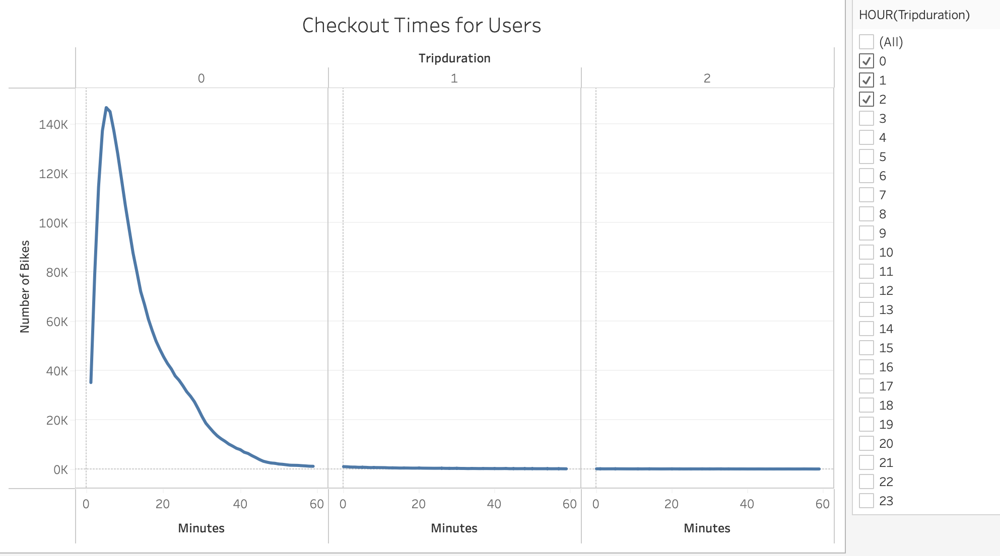
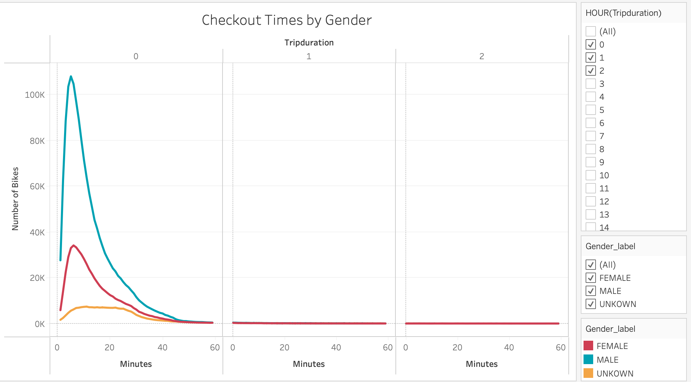
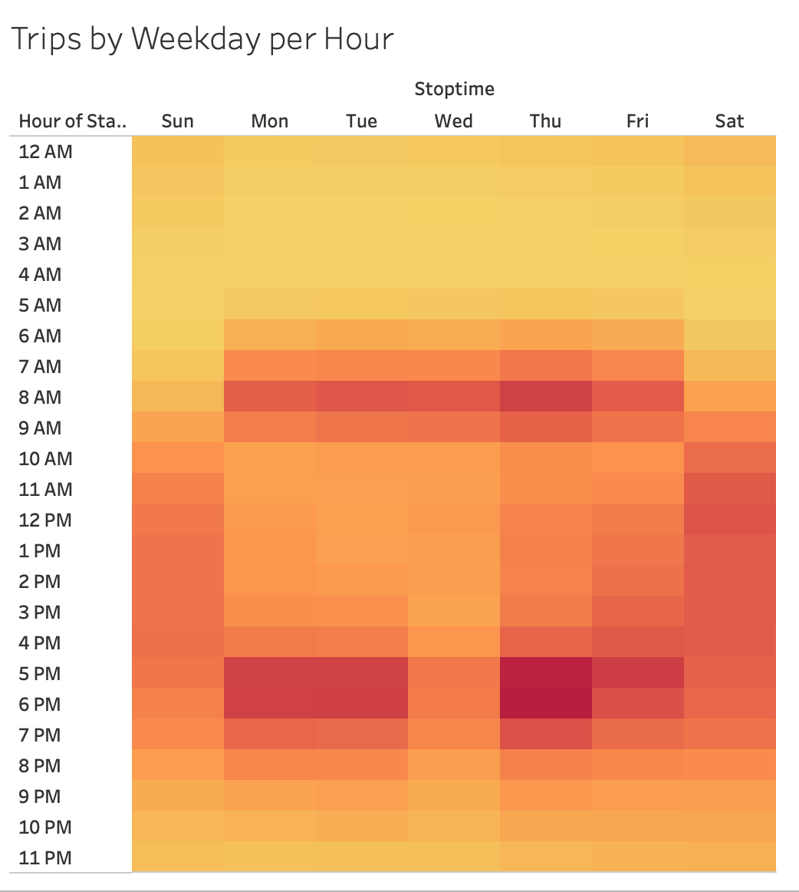
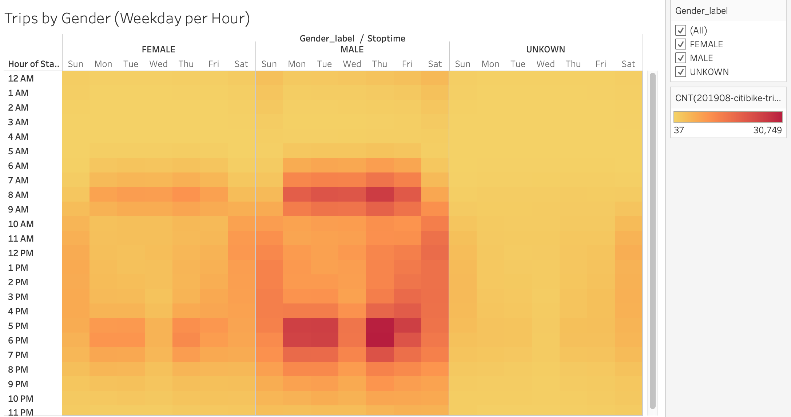
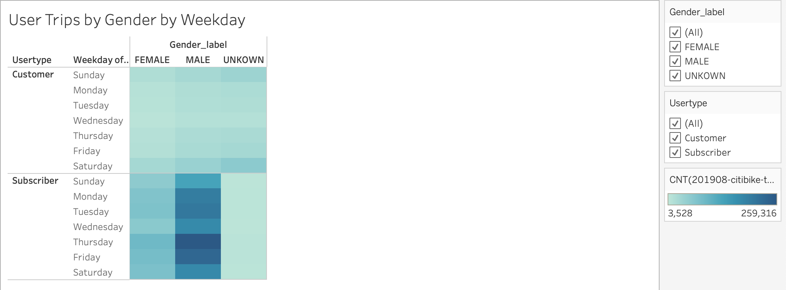
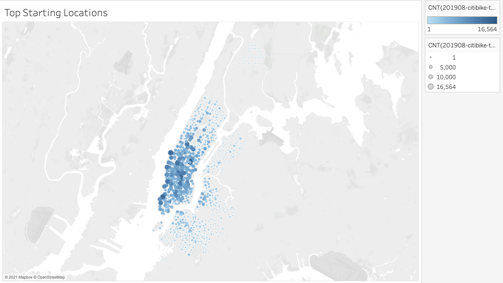
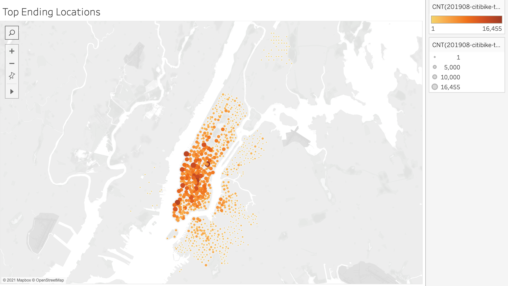
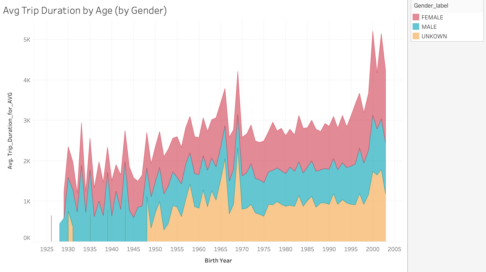

# bike_city

[link to dashboard](https://public.tableau.com/profile/danie7993#!/vizhome/NYC_Citibike_Challenge_16199141820460/Story1?publish=yes)

## Overview 

The purpose of this analysis was to solidify the proposal to convince investors that a bike-sharing program in Des Moines is a good idea based on data from the NYC bike-sharing program.  The results below include visualizations better to tell the story for the pitch to investors. 

## Results
As stated above, these results are based on NYC city-data. While it will probably not be identical to the Des Moines program, relevant insights are helpful to look into or consider before starting a similar program in a new city. 

### Checkout Times by Users
This first graph looks at what may be an ideal time to service bikes by the number of cycles checked out by users. As shown below, looking at 12 midnight - 2 am, the number of checkouts decreases substantially from 12:40-2 am, which would be the best time since very few bikes are checked out during this time. 

### Checkout Times by Users - Gender
Like the graph above, this pulls the information of checkout bikes by the hour for each Gender. As you can see, Men are much more likely to be checking out bikes from 12 am - 12:40 am than Females in New York City, a trend that could be similar to Des Moines. 

### Trips by Weekday per Hour
The chart below shows the number of trips taken by hour and weekday. It shows that people are riding the most on the weekends from 10am -5pm and during the weekdays 7am-9am and 5p-7pm. This makes sense especially on the weekdays and people could be using the bikes to get to and from a 9-5 workday, which is another finding we could hypothesize as a similar trend Des Moines might see. 

### Trips by Weekday per Hour - by Gender
In addition to looking at overall trips, we looked at trips by weekday per hour cut by gender and can tell that men are the ones predominantly using the bikes from the program at nearly all times, this could be an opportunity to try and incentivize females through special promotions, discounts and targeted advertising to try the bike sharing program. 

  
### User Trips by Gender by Weekday
User trips by Gender and Weekday chart confirm the findings of men using the bikes more often than women and goes a step further by showing the most popular days for men and women using the bikes is Thursday and Friday. It also tells us that Subscribers have much higher usage than the average customer.  It may be interesting to follow up in a survey asking customers who did not return to use the bikes to understand why they did not or why subscribers like the programs to better understand these two audiences. 

### Top Starting Locations
It is not surprising that the top starting locations are the top tourist areas in New York. If Des Moines has more likely places to attract visitors, they could prepare by providing more bikes to try and get ahead of the demand. 

### Top Ending Locations
Looking at the top ending locations also provides good news that bike maintenance will be in concentrated areas for the most part, which makes travel time between bikes short which could allow more cycles to be fixed in the 12:40-2 am window.   

### Average Trip Duration by Gender
The last graph provides another user insight as we can see that although men use the bike more, women across all ages tend to take longer trips, and there is a direct correlation between the age of the women riding and the length that they bike.  

## Summary
Overall, the information above provides a good starting point for when and where bike maintenance could occur between 12:40 am-2 am at the top-visited site. It also shows the bikes' different demographics - customers v subscribes, men v female, and age. The last graph on the average trip duration could be used as a starting point to start looking into other demographics and usage such as household income, parents v non-parents, and if bike-sharing users own any different type of transportation. Using the data we do have, we could provide:
Similar graphs are looking closer at the age for the checkout times.
Trips by weekday/by the hour.
Starting/ending locations. 
